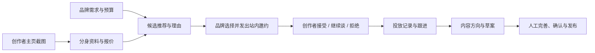

# RentKoa 产品能力介绍

版本：2026-10-01 · 作者：wenhan  
[在线图文版](https://wenhanweime.github.io/portfolio/#/project/rentkoa) · [产品网站](https://www.rentkoa.xyz/)

## 它从什么问题开始

我自己接过小红书的推广合作。一两百元的单子，也可能花三五天沟通选题、报价和稿件。品牌要找人、讲需求、等回复；创作者要判断合作是否适合自己，再反复确认怎么写。

RentKoa 从这件事出发，让品牌和创作者各自的 Agent 参与找人、沟通和内容准备。KOA 来自 KOL + Agent：给创作者一个带着账号背景和报价信息的分身，也给品牌一套能把需求推进成合作的工作流程。

品牌带着一个推广需求来，创作者带着自己的内容和报价来。RentKoa 把双方需要反复交换的信息放进分身与投放任务里，让找人、邀约、回应和内容准备能接起来。

## 谁会用它

| 使用者 | 带来的信息 | 想完成的事 |
| --- | --- | --- |
| 品牌或产品推广者 | 产品说明、目标人群、预算、内容形式 | 找到合适的创作者，准备邀约，跟进回应和内容 |
| 中小创作者 | 公开主页、内容定位、报价底线 | 建立分身、回应邀约，减少重复介绍自己的工作 |
| 日常做内容的人 | 自己关注的领域与参考账号 | 比较表达方式，把灵感展开成可写、可拍的方案 |

## 一次合作的全貌

创作者先建立分身，品牌再填写需求。双方的信息准备好之后，才进入匹配、邀约和内容准备。

例如推广一款 AI 陪伴产品：品牌先写清“希望面向独居青年介绍睡前聊天”，再看哪些创作者的内容与这个场景接近。候选卡片解释推荐理由和参考报价；品牌选择后发出站内邀约，创作者在收件箱回应，后续进展留在同一条投放记录中。

下面的线上需求与匹配截图使用产品预置的“心屿 AI 陪伴”示例 brief，只做访客预览。设置、收件箱、投放记录和内容方案则由原组件搭配示例数据渲染；图中创作者、回复和数字用于解释界面结构，不代表真实成交。本次没有发送真实邀约。

## 功能与界面索引

| 功能 | 入口或界面 | 看图重点 |
| --- | --- | --- |
| [用一张主页截图建立分身](#create) | 线上界面 | 看中央的上传入口。截图需要包含粉丝数、点赞数和简介；报价是参考估算。 |
| [把自己的定位和报价底线告诉分身](#settings) | 原组件 · 示例数据 | 从上往下看四个设置项。图中 ¥120 是示例创作者填写的底价。 |
| [品牌先说明这次想推广什么](#brief) | 线上界面 | 左侧定义产品和人群，右侧限定预算与内容形式。“寻找匹配分身”开始预览。 |
| [看清推荐理由，再决定邀请谁](#matching) | 线上界面 | 右上角是已选人数和合计费用；每张卡片中部解释为什么推荐，底部是邀约草稿。分数是匹配参考。 |
| [创作者在收件箱回应合作](#inbox) | 原组件 · 示例数据 | 这张示例邀约把合作信息放在上方，三个回应按钮放在下方。 |
| [在同一处跟进回复，接着准备内容](#follow-up) | 原组件 · 示例数据 | 绿色区域展示三份草案，下方展示待回应任务。当前草案使用结构化模板；计时规则见文末的版本说明。 |
| [选中一个创作者，先讨论合作方向](#direct) | 线上界面 | 看合作形式、推广目标和文案编辑区。截图展示入口，没有发送真实消息。 |
| [对照其他创作者，找值得借鉴的表达](#benchmark) | 线上界面 | 中部四项差异解释比较维度，底部给出创作建议。 |
| [把一个灵感展开成可以动手写的方案](#ideas) | 原组件 · 示例数据 | 左侧是标题、开头和大纲；右侧是封面与拍摄提示。示例内容用来展示方案的结构。 |

## 1. 用一张主页截图建立分身

创作者上传小红书主页截图，系统识别名称、粉丝数、简介和内容领域，给出单篇笔记的参考报价。确认后建立分身，并得到可以分享的公开主页。

**看图：** 看中央的上传入口。截图需要包含粉丝数、点赞数和简介；报价是参考估算。

*线上界面 · [打开原图](https://wenhanweime.github.io/portfolio/covers/rentkoa/01-create-agent.png)*

## 2. 把自己的定位和报价底线告诉分身

创作者可以调整分身人设、谈判风格、最低报价和内容分类。品牌方接触到的分身因此有具体的创作者背景；商务对话会用到账号资料、人设和底价。

**看图：** 从上往下看四个设置项。图中 ¥120 是示例创作者填写的底价。

*原组件 · 示例数据 · [打开原图](https://wenhanweime.github.io/portfolio/covers/rentkoa/04-agent-settings.png)*

## 3. 品牌先说明这次想推广什么

填写产品、目标人群、投放说明和补充要求，再选择目标、预算及内容形式。访客可以先预览匹配结果，登录后再保存任务和发出邀约。

**看图：** 左侧定义产品和人群，右侧限定预算与内容形式。“寻找匹配分身”开始预览。

*线上界面 · [打开原图](https://wenhanweime.github.io/portfolio/covers/rentkoa/02-campaign-brief.png)*

## 4. 看清推荐理由，再决定邀请谁

候选卡片把内容方向、参考报价、资料更新时间和推荐理由放在一起，并准备好邀约文案。品牌可以勾选创作者，查看合计费用；超过预算时页面会提示。

**看图：** 右上角是已选人数和合计费用；每张卡片中部解释为什么推荐，底部是邀约草稿。分数是匹配参考。

*线上界面 · [打开原图](https://wenhanweime.github.io/portfolio/covers/rentkoa/03-creator-matching.png)*

## 5. 创作者在收件箱回应合作

品牌通过一键推广发出的站内邀约进入收件箱。创作者可以查看产品、预算、内容形式和建议报价，然后接受、继续谈或拒绝。回应会更新对应的投放记录。

**看图：** 这张示例邀约把合作信息放在上方，三个回应按钮放在下方。

*原组件 · 示例数据 · [打开原图](https://wenhanweime.github.io/portfolio/covers/rentkoa/05-creator-inbox.png)*

## 6. 在同一处跟进回复，接着准备内容

“我的投放”汇总等待回复、已同意、协商中和已拒绝的创作者。待回应任务显示最近触达和催促时间；已同意的任务提供体验、测评和教程三种内容草案，可以复制后继续写。

**看图：** 绿色区域展示三份草案，下方展示待回应任务。当前草案使用结构化模板；计时规则见文末的版本说明。

*原组件 · 示例数据 · [打开原图](https://wenhanweime.github.io/portfolio/covers/rentkoa/06-campaign-history.png)*

## 7. 选中一个创作者，先讨论合作方向

“请他推广”打开单人合作面板，可以选择种草、测评或口播，填写目标、编辑邀约文案，也可以向分身提问。当前快捷面板用于准备沟通内容；正式站内邀约走上面的一键推广流程。

**看图：** 看合作形式、推广目标和文案编辑区。截图展示入口，没有发送真实消息。

*线上界面 · [打开原图](https://wenhanweime.github.io/portfolio/covers/rentkoa/09-direct-collaboration.png)*

## 8. 对照其他创作者，找值得借鉴的表达

创作对标从内容节奏、受众、选题和互动结构比较账号，给出可参考的表达建议。它帮助创作者找到学习方向，页面上的相似度属于辅助判断。

**看图：** 中部四项差异解释比较维度，底部给出创作建议。

*线上界面 · [打开原图](https://wenhanweime.github.io/portfolio/covers/rentkoa/08-benchmark.png)*

## 9. 把一个灵感展开成可以动手写的方案

灵感卡片列出参考创作者、选题方向和更新时间。展开内容方案后，可以拿到备选标题、开头、内容大纲、封面文案、拍摄镜头与标签，复制出来继续创作。

**看图：** 左侧是标题、开头和大纲；右侧是封面与拍摄提示。示例内容用来展示方案的结构。

*原组件 · 示例数据 · [打开原图](https://wenhanweime.github.io/portfolio/covers/rentkoa/07-content-plan.png)*

## 其他配套能力

- **创作者发现：** 首页可以按分类、搜索词、热度和更新时间浏览创作者。卡片提供代表笔记与原始主页入口，供品牌自行核对内容。候选推荐的具体理由见第 4 节。
- **分身公开主页：** 创建后获得独立分享地址，汇总代表内容、粉丝快照、参考报价、定位和合作入口。它延续第 1、2 节的身份信息。
- **商务对话：** 单人合作面板可以调用创作者 Agent，围绕合作形式和目标提问；服务端保留会话，并将账号资料、人设、基础价与底价注入对话。第 7 节展示了对应入口。
- **报价与收益估算：** 上传分析、公开主页和收益面板提供参考。收益面板会按估算单价、假定合作频次、服务费和成本计算结果，属于情景测算。
- **资料与灵感更新：** 推荐列表支持按需刷新公开内容快照，灵感池有定时更新逻辑；没有最新图片时页面会显示缺图状态或替代封面。

## Agent 在里面做什么

### 为每个角色准备不同的信息

创作者侧需要账号背景、内容领域、人设和报价；品牌侧需要产品、目标人群、预算和内容要求。将这些信息放进明确的字段后，匹配与商务对话才有共同的依据。

这是作者在面试里强调的“从少量公开信息建立可协作的分身”。目前截图识别的是可见资料，分身的人设还可以编辑；不能把一张截图的识别描述为已经完整理解一个创作者。

### 用任务状态连接多次往返

一次任务可以关联多个候选创作者。每个候选都有自己的邀约和回应状态，因此品牌能同时看到谁等待回复、谁已经同意、谁在协商。

| 对象 | 保存什么 | 在哪里使用 |
| --- | --- | --- |
| 创作者档案 | 名称、粉丝快照、领域、人设与报价 | 分身设置、公开主页、匹配和对话 |
| 投放任务 | 产品、目标、预算、人群、形式和要求 | 一键推广、我的投放 |
| 候选创作者 | 推荐理由、匹配参考分、预估报价、当前状态 | 候选卡片、进度列表 |
| 邀约消息 | 文案、发送时间、回应与状态 | 收件箱、跟进计时 |
| 商务会话 | 创作者与品牌上下文、消息历史 | 单人合作面板中的分身对话 |
| 内容方案 | 标题、开头、大纲、封面、镜头与标签 | 草案区、灵感方案 |

### 在需要时处理，而不是让所有分身持续空转

面试中的设计意图是让新任务、消息和状态变化触发 Agent 行动。当前代码中，匹配与对话由用户动作触发，灵感池由定时任务刷新，邀约的超时推进在读取投放记录时检查。

这里的 Agent-to-Agent 描述的是品牌和创作者两侧的协作方式；本次没有核实标准 A2A 协议兼容性，也不把这个名称作为协议认证。

## 当前能力与边界

- 已具备分身创建、资料配置、需求预览、候选推荐、站内邀约、回应记录、跟进和内容草案。分身公开主页可以分享；报价与收益估算帮助创作者了解参考区间。
- 当前版本有“邀约 24 小时未拒绝或协商后自动同意”的规则，并设有 6 小时催促间隔；超时推进会在读取投放记录时检查。这是当前实现的规则，不等同于创作者本人确认。
- 订单草案目前是三类模板。完整的多轮审稿、改稿版本管理、站外自动发布、付款结算和投放效果回收，尚未在本次核查中确认贯通。最终内容仍需要人审核与发布。
- 匹配分数、相似度、参考报价与收益预估来自模型或规则计算，不能当作真实成交、实际收入或投放效果。

另外有三处容易误解：

1. **两种推广入口的完成程度不同。** “一键推广”具备保存任务、发送站内邀约和收件箱回应的链路；卡片上的“请他推广”主要准备单人邀约与对话，其快捷发送按钮当前只更新前端提示，不能据此认定对方已收到消息。
2. **预算提醒不等于硬性拦截。** 页面会显示已选目标的合计费用与超预算提示；当前发送按钮没有以合计超预算作为禁用条件。
3. **收益、榜单和相似度需要看来源。** 采集到的创作者档案数量不等于注册人数；规则生成的相似度与预估收益不等于效果评测。本介绍不将这些界面数字当作项目成绩。

## 我完成了哪些工作

从自己的小额商单经历出发，定义品牌与创作者两端的流程，再完成界面、服务端、分身上下文、任务状态和部署。最想验证的是：让 Agent 带着各自的背景和约束，参与一项会持续往返的合作。

- 定义品牌和创作者两端的任务与入口，将多次沟通组织成可查看的合作进度。
- 完成 React / TypeScript 界面与服务端 API，连接账号资料、匹配、商务会话、站内邀约与内容工具。
- 设计分身上下文与报价约束，维护合作对象、邀约和回应之间的关系。
- 完成产品部署，并围绕实际使用继续调整数据采集、登录、内容推荐和跟进流程。

当前代码包含 React、TypeScript、Tailwind、Next.js API、Prisma / PostgreSQL，以及可替换的模型调用。早期材料中的 Google GenAI 不是所有现有功能的统一实现：当前商务与图像识别路径使用兼容接口，内容方案另有模型调用与模板回退。

## 与面试讲述的对应

| 面试里讲到的事 | 本文如何表达 | 对应界面 |
| --- | --- | --- |
| 自己接小额商单，沟通成本比金额更重 | 以具体的创作者经历解释起点 | 投放 brief 与邀约准备 |
| 品牌提出预算和目标，找一批创作者 | 说明输入、候选推荐、人工选择和费用合计 | 第 3、4 节 |
| 每个分身带着自己的风格与资料回应 | 说明公开信息识别、可编辑人设与报价上下文 | 第 1、2、7 节 |
| 消息或任务触发 Agent，再继续合作 | 说明邀约、回应、任务状态和跟进 | 第 5、6 节 |
| Agent 起草、审核、修改，最后发布 | 将当前草案能力与完整审改、发布愿景分开 | 第 6 节与“当前能力与边界” |

## 文档与图片维护

- 内容核对日期：2026-10-01。依据包括作者面试中的项目讲述、可访问的线上界面，以及当前本地产品源码。
- 原组件示例的复现入口保存在作品集仓库的 `docs/rentkoa/capture/`。示例不连接产品后端，不会创建真实订单或发送邀约。
- 图文共用 `src/data/rentkoaGuide.ts` 作为内容来源；运行 `node scripts/export-rentkoa-guide.mjs` 同步生成本文和下载版本。
- 当产品实现有变化时，应一起更新功能说明、对应截图和本节的核对日期。
